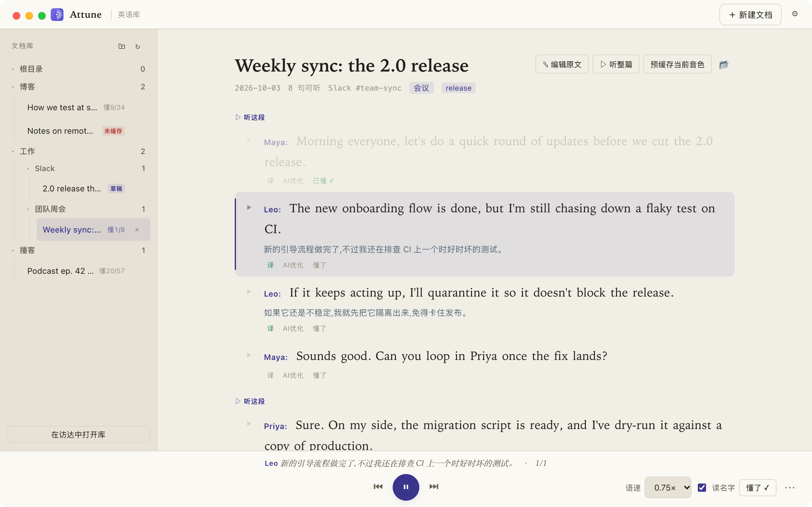
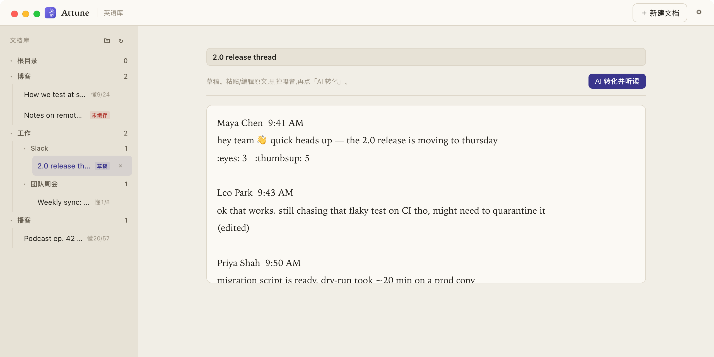
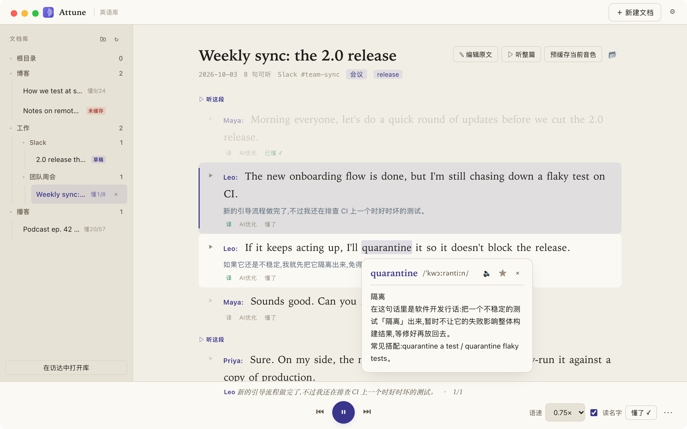

# Attune · 英语听读学习工具

**把你每天真正要读的英文,变成可以逐句精听的听力材料。**

Slack 聊天、会议纪要、英文博客、播客文字稿……粘贴进来,AI 帮你清理杂乱内容、切成一句一句、配上中文翻译,再给每句生成自然的朗读。你可以一句一句地听、反复听、点开不懂的词——直到不看文字也能听懂。



## 它能帮你做什么

### 1. 粘贴原文,一键变成听读材料

直接粘贴从聊天工具、网页里复制的原始文本,不用先整理。表情、点赞数、链接、「(edited)」这类噪音,AI 会自动去掉,还能认出是谁在说话。



### 2. 逐句精听,边听边看译文

- 点任意一句就读这一句;也可以「听这段」或「听整篇」连续播放。
- 支持 **单句循环**、**调慢语速**,适合反复磨耳朵。
- 播放时底部显示这句的 **中文翻译**,听英文、看中文对照;每句也可以单独点「译」展开。
- 听懂的句子点「**懂了**」,之后连续播放会自动跳过,只练没听懂的。
- 句子里有语音转写的错别字?点「**AI 优化**」修正。

### 3. 点词即查,结合上下文解释

点句子里任何一个单词,弹出 **音标**、**发音** 和 **这个词在这句话里的意思**。一词多义和工作中的行话(比如 *quarantine a test*、*cut a release*)也能讲清楚。



### 4. 你的资料,存在你自己的文件夹里

像 Obsidian 一样,自己选一个文件夹当「英语库」,文档和音频都在里面,可以建子文件夹分类。换电脑、备份、同步,只需要搬这一个文件夹。

## 安装(macOS)

1. 到 [Releases](https://github.com/gebilaoman/Attune/releases) 下载最新的 `Attune_x.x.x_universal.dmg`(Intel 和 Apple Silicon 通用),打开后把 **Attune** 拖进「应用程序」。
2. **首次打开会被系统拦截**(本应用没有做 Apple 公证),提示「已损坏」或「无法验证开发者」。打开「终端」执行一次下面这行,之后就能正常双击打开:
   ```bash
   xattr -cr /Applications/Attune.app
   ```
   或者在「应用程序」里右键 Attune → 打开 → 再点「打开」。
3. 首次启动会进入 **设置**:
   - 选一个文件夹当英语库。建议 **不要** 放在「文稿 / 桌面 / 下载」里,否则 macOS 会反复弹访问权限提示。
   - 填 AI 服务的 API Key(默认智谱 GLM,也兼容任何 OpenAI 协议的服务)。
   - 选朗读音色。最省事的是 **macOS 系统音色**:离线、免费、不用装任何东西。到「系统设置 → 辅助功能 → 朗读内容(Read & Speak)」下载高质量音色(如 Ava (Premium)),再在设置里点「扫描系统音色」即可。

之后有新版本时,应用内会提示,点一下就能自动更新。

## 三步上手

1. 点「**＋ 新建文档**」,粘贴英文原文,点「**AI 转化并听读**」。
2. 等几秒,原文变成一句句带翻译的句子。
3. 点句子开始听;不懂的词点一下;听懂了点「懂了」。

---

> 以下是给开发者的技术说明。

## 架构

Tauri 2(Rust core + WebView 前端 + 原生 JS + JSON 数据驱动 + 可配置 AI 提供者 + 本地缓存)。

```
任意文本粘贴
   │  [AI 清理四步:滤噪音 / 保结构 / 切句标注 / 翻译](复用 AIProvider)
   ▼
文档 JSON(嵌套块)── 唯一真身,跟用户选的 vault 文件夹走
   │  [edge-tts 批量生成句级 mp3](scripts/tts_generate.py,文件名 = 句 id)
   ▼
桌面层级折叠阅读器:点块/句播放 · 单句循环 · 调速 · 句间隔 · 懂了跳过 · 点词即查
```

### 目录结构

| 路径 | 作用 |
|---|---|
| `crates/core` | 平台无关核心:`note`(文档/块/句模型)+ `ai_provider`(OpenAI 兼容 chat 提供者) |
| `gui/src-tauri` | Tauri 后端命令:导入 / 音频 / vault / 即查 / 配置 |
| `gui/{index.html,main.js,styles.css}` | 前端阅读器(原生 JS) |
| `scripts/tts_generate.py` | edge-tts 句级 mp3 预处理脚本 |

### 存储(config 与 content 分离;文档树与音频树分离)

- **JSON 是真身**:每篇文档 = vault 内一个 `.json`,统一放在 `docs/` 下(可任意建子文件夹分类)。
- **音频**:统一放在 vault 级的 `media/` 下,按 `media/{note.id}/{音色}[-nospk]/{句序号}.{mp3|wav}` 组织。按 `note.id` 索引、与文档所在子文件夹解耦 —— 重组/移动文档不会让音频失联,不必重新生成。
- **配置**(provider / key / vault 路径 / TTS)留在 app 数据目录(`~/Library/Application Support/Attune`)。
- vault 像 Obsidian 一样随意选文件夹;换机/备份/同步只是搬一个文件夹。

```
我的英语库/                          ← 用户选的 vault
├── docs/                            ← 所有文档(可再分子文件夹)
│   └── 工作/SDK集成/
│       └── 2026-07-25 会议.json     ← 一篇文档(真身)
└── media/                           ← 所有音频,按 note.id 索引
    └── note_xxx/
        ├── zh_female_vv_uranus_bigtts/   ← 一个音色一个目录
        │   ├── 1.wav
        │   └── 2.wav
        └── en-US-AriaNeural-nospk/       ← 「不读姓名」变体
            └── 1.mp3
```

## 运行依赖(非系统音色)

- **逐句音频**:macOS 系统音色由 Rust 直接调 `say`,无需任何依赖;用 edge-tts(免费)音色时,需要 `python3` + edge-tts:
  ```bash
  pip install --index-url https://pypi.org/simple/ edge-tts
  ```
  纯走云端厂商(智谱 GLM 等)则不需要本地依赖。
- 首次启动在**设置**里:选一个文件夹当 vault、配 AI 提供商与 API Key、选 TTS 音色。

> 应用内「检查更新」依赖 Release 里的 `latest.json` + `.app.tar.gz(.sig)`,用同一把更新器私钥验证。

## 开发

```bash
# 前置:Rust(nightly/stable 1.85+),Node,pnpm,Python3 + edge-tts
pip install --index-url https://pypi.org/simple/ edge-tts   # 清华源没有,用官方源

cd gui
pnpm install        # 首次
pnpm tauri dev      # 启动开发
pnpm tauri build    # 打包
```

首次启动会自动弹出**设置**:选一个文件夹当 vault、配置 AI 提供商与 API Key(默认智谱 GLM,兼容任何 OpenAI 协议服务)、选 TTS 音色。

## 范围说明(本版本)

- ✅ 核心:AI 四步清理、句级 mp3、多粒度精听、懂了跳过、点词即查、Obsidian 式 vault。
- ⏭️ 未做(见需求文档第 8 节):记生词/词库/复习、局域网手机网页播放器、导出整篇 mp3、SQLite 检索索引、拖拽嵌套。

> 生词记录等进阶功能明确列在本版本范围外。即查(听读时点词弹释义)是做的,与"记词"是两码事。
